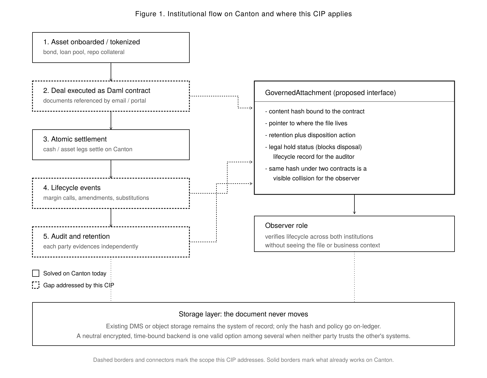
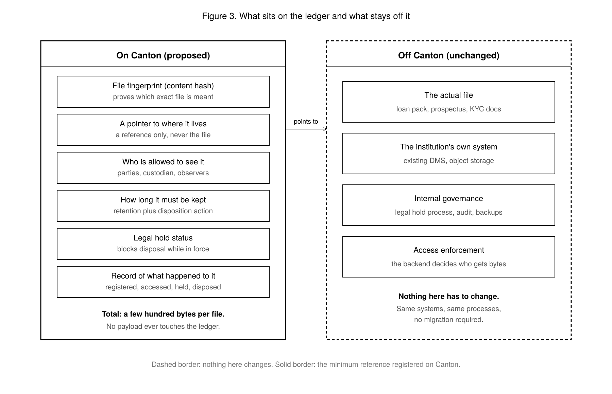
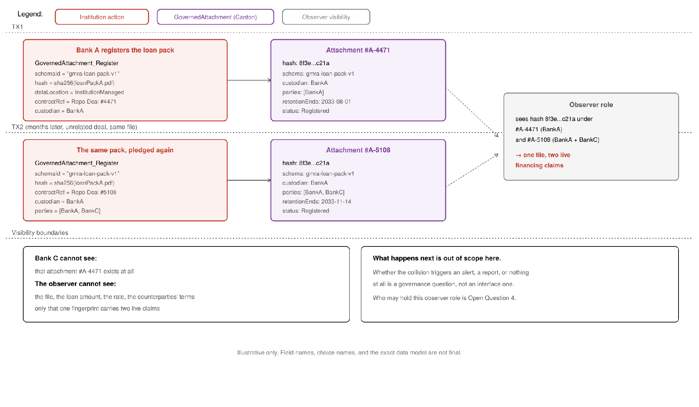
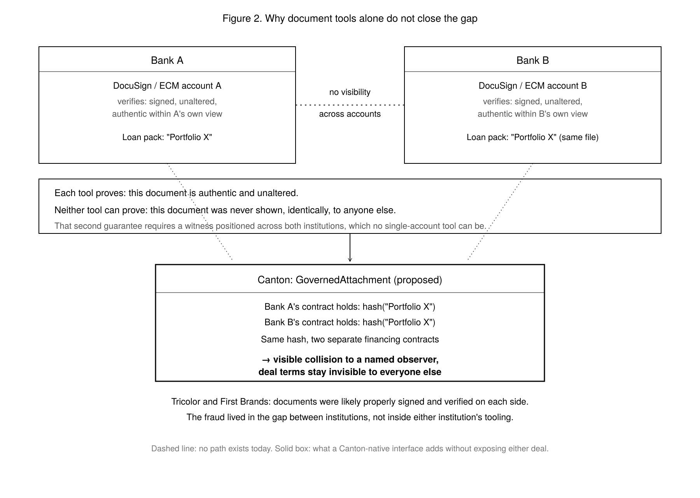

# File Governance for Multi-Party Contracts

A discussion CIP for the Canton Foundation — Identity and Metadata SIG

<pre>
  CIP: ?
* Layer: Daml, Applications
  Title: File Governance for Multi-Party Contracts
  Author: Nandit Mehra (Lighthouse) &lt;nandit@lighthouse.storage&gt;
* Discussions-To: cip-discuss@lists.sync.global
  Status: Draft
  Type: Standards Track (Discussion)
  Created: 2026-08-14
  License: CC0-1.0
* Post-History:
</pre>

## Abstract

Every institution on Canton already knows how to manage its own files: loan documents, prospectuses, signed agreements, KYC packs. Enterprise systems handle that well, and this CIP does not ask any institution to change how they store, secure, or govern their files internally.

The gap shows up somewhere else. When a Canton contract is shared between two institutions, and both reference the same file, there is currently no way for either side, or an auditor, to check they are talking about the same file, confirm neither side altered it, or prove it followed its required lifecycle once the deal ended.

This CIP proposes no code and asks for no funding. It lays out the problem, shows where it costs real money today, surveys what already exists and where each existing answer stops, and asks the Canton community one question: is this a gap worth closing with a shared standard, and if so, where should the line sit between what Canton tracks and what stays in each institution's own systems.

## Motivation

### Why This Matters to Canton

Canton is winning document-heavy workloads: repo, tokenized bonds, private credit, custody. Every one of those deals has a paper trail that currently lives off the platform, in email and shared drives, disconnected from the contract that depends on it. That is a gap in what Canton offers institutions moving these workflows on-chain, and competing infrastructure has not closed it either. Closing it is a reason for more of that volume to land here rather than staying off-chain.

This is not hypothetical for the institutions already arriving. JPMorgan's Kinexys unit announced plans in April 2026 to issue JPM Coin natively on Canton. JPMorgan is also one of the lenders that disclosed a **$170 million** charge-off from the Tricolor collateral fraud described below, the exact failure mode this CIP is about. An institution moving onto Canton has already paid the cost of this gap elsewhere.

### The Problem

Picture two banks financing the same kind of deal. Both trust their own file systems completely. Neither can see inside the other's.

That blind spot is not hypothetical. It already cost banks real money, and it kept costing them for as long as nobody could check across institutions.

**Tricolor Holdings (2025).** Auto-loan files were pledged to multiple banks at once over roughly seven years. Each bank's checks passed; the same files had simply been shown to more than one lender. JPMorgan disclosed a $170 million charge-off, Fifth Third an impairment of $170 to $200 million, and Barclays, Origin Bancorp, and Triumph Financial also took write-downs. Executives were later federally indicted.

**First Brands Group (2025).** The same invoices were sold or pledged to more than one lender, including Raistone, Jefferies' Leucadia Asset Management, Evolution Credit Partners, and Katsumi Global. Lenders discovered this only after bankruptcy, once liabilities running into the billions surfaced.

**Qingdao Port, China (2014).** The same metal warehouse receipts were pledged to 13 banks at once, raising over $1.7 billion. Citi and trader Mercuria alone disputed roughly $270 million between them; Standard Chartered, ANZ, Natixis, and Rabobank were also named as exposed or froze credit lines.

| Case | What was pledged twice | Banks affected | Named loss |
| :---- | :---- | :---- | :---- |
| Tricolor (US, 2025) | Auto loan files | JPMorgan, Fifth Third, Barclays, Origin Bancorp, Triumph Financial | $340M+ disclosed |
| First Brands (US, 2025) | Invoices, receivables | Raistone, Leucadia (Jefferies), Evolution Credit Partners, Katsumi Global | Billions in newly surfaced liabilities |
| Qingdao Port (China, 2014) | Metal warehouse receipts | Citi, Standard Chartered, ANZ, Natixis, Rabobank | $1B+ international |

The pattern repeats: each institution's own file checks worked correctly. The fraud lived entirely in the blind spot between institutions, the one place no single company's tools can see.

To be precise about the claim: a shared way to check across institutions would not have stopped anyone determined to commit fraud. That requires intent, not a technology gap. What it would very likely have done is shorten the window. The same file surfacing under a second lender's name would have been a visible collision on day one, instead of a discovery made years later, after the collateral had already been financed nine times over.

### How Big This Is

None of these figures are Canton-specific. They describe the document-exchange friction across the industry Canton is hosting.

* Corporate treasurers rank "different banks ask for different documents, no shared standard" as a top complaint in Thomson Reuters' KYC research.
* Corporate dissatisfaction with KYC document processes rose from 73% in 2024 to 95% in 2026, and nearly half of corporates admit sending sensitive files over plain email (Encompass).
* Capital markets spend an estimated $50 billion a year manually reconciling mismatched records between institutions (Axoni).
* A single trade finance deal can involve over 100 pages of paperwork, with roughly 4 billion pages circulating industry-wide each year (ICC).

Whether Canton's own participants feel this specific pain in their on-chain workflows is genuinely an open question, not a claim this CIP makes for them. Answering it is Open Question 1 below, and a primary purpose of posting this.

## Specification

This CIP is posted for discussion and defines no normative requirements at this stage. This section describes where the gap sits, proposes a boundary for what a future standard would and would not track, and offers a worked sketch to make the discussion concrete. Nothing in it is proposed for adoption.

### Where the Gap Sits



*Figure 1. The institutional flow, and where files fall out of the picture*

Steps 1 and 3 (tokenizing an asset, settling it) already work well on Canton. The gap opens at deal execution, at every lifecycle update, and at audit time. Three points where the file that matters most is not tracked by the platform recording everything else about the deal.

### What Belongs on Canton, and What Does Not



*Figure 2. The boundary between what Canton tracks and what stays where it is*

The proposed instinct is minimal by default. Canton holds a fingerprint of the file, a pointer to where it lives, who is allowed to see it, how long it must be kept, and a record of what happened to it. The file itself, and everything about how an institution stores and protects it internally, never moves and never has to.

### Illustrative Interface Sketch

Everything above is the proposal: a problem, evidence, and six open questions. What follows is different in kind. It is a worked sketch, written to make the discussion concrete rather than abstract. Field names and the exact data model are not final and are not proposed for adoption. If the community agrees the gap is real, this is a starting point for the specification that would follow, not a substitute for one.

#### Walkthrough: how a double-pledge surfaces

Bank A finances a loan pack under Repo Deal #4471. Months later, unrelated to that deal, the same loan pack is pledged again under Repo Deal #5108, this time also involving Bank C.



*Figure 3. The double-pledge walkthrough*

**TX1, Bank A registers the first attachment.**

```daml
exercise GovernedAttachment_Register
  with
    schemaId      = "gmra-loan-pack-v1"
    hash          = sha256(loanPackA.pdf)
    dataLocation  = InstitutionManaged "bankA-dms://..."
    contractRef   = "Repo Deal #4471"
    custodian     = BankA
    parties       = [BankA]
    retentionEnds = 2033-08-01
```

**TX2, months later, the same file registered under a different deal.**

```daml
exercise GovernedAttachment_Register
  with
    schemaId      = "gmra-loan-pack-v1"
    hash          = sha256(loanPackA.pdf)     -- identical
    dataLocation  = InstitutionManaged "bankA-dms://..."
    contractRef   = "Repo Deal #5108"
    custodian     = BankA
    parties       = [BankA, BankC]
    retentionEnds = 2033-11-14
```

Neither Bank A nor Bank C can see the other attachment. An observer scoped across both sees two independent records sharing one fingerprint, bound to two active, unrelated financing contracts. It never sees the file, the loan amount, the rate, or any term of either deal. Only that one fingerprint now carries two live claims.

#### The data model

Two layers, following the schema and attestation separation Sign Protocol uses, and the retention vocabulary Box established.

```daml
-- ILLUSTRATIVE ONLY, not a final interface

-- A schema defines governance rules for a class of document,
-- registered once and reused across every deal that uses it.
data AttachmentSchema = AttachmentSchema with
    schemaId          : Text      -- "gmra-loan-pack-v1"
    documentClass     : Text      -- human-readable label
    defaultRetention  : RelTime
    dispositionAction : DispositionAction
    requiredObservers : [Party]

data DispositionAction
  = PermanentlyDelete
  | RetainIndefinitely
  | ReturnToCustodian

-- An attachment is an attestation conforming to a schema.
interface GovernedAttachment where
  viewtype GovernedAttachmentView

data GovernedAttachmentView = GovernedAttachmentView with
    schemaId         : Text
    hash             : Text
      -- fingerprint only; the file never goes on-ledger
    dataLocation     : DataLocation
    contractRef      : Text
    custodian        : Party
      -- the party accountable for the file and its disposition
    parties          : [Party]
    observers        : [Party]
    retentionEnds    : Time
    legalHold        : Optional LegalHold
      -- when present, blocks disposition regardless of retention
    linkedAttachment : Optional Text
      -- for amendments and supersessions
    status           : AttachmentStatus

data DataLocation
  = InstitutionManaged Text   -- existing DMS or object store
  | ContentAddressed Text     -- IPFS, Filecoin, Walrus, DStash
  | Custom Text

data AttachmentStatus
  = Registered | Accessed | HoldApplied
  | HoldLifted | RetentionClosed | Disposed
```

Choices follow the same vocabulary: `_Register`, `_RecordAccess`, `_ApplyHold`, `_LiftHold`, `_Dispose`. Two rules borrowed directly from Box: a legal hold blocks `_Dispose` regardless of retention, and where two retention periods apply to the same file, the later expiry governs.

Following Sign Protocol's revocation model, a disposed attachment is not removed from the ledger. The record of disposition persists, because the evidence that a file was properly destroyed is itself the audit artifact a regulator asks for.

## Rationale

### Why Existing Tools Do Not Close This



*Figure 4. Authenticity versus exclusivity*

A natural question, and a fair one: don't DocuSign or enterprise document systems already solve this?

They solve a different problem. DocuSign proves a file was not altered after your bank received it. It says nothing about whether the exact same file was also handed to a different bank down the street. Call the first guarantee authenticity and the second exclusivity. Exclusivity requires something positioned across both institutions, and no single-account tool can be that, because no institution would grant a vendor visibility into both sides of a private deal.

In Tricolor and First Brands, the files were very likely properly signed and verified inside each bank's own systems. That is precisely why the fraud worked: verification stopped at each bank's front door.

### Prior Art

#### What institutions use today

**Box, iManage, OpenText and similar** are genuinely good at managing files inside one company. They handle how long a document is kept, what happens when that period ends, when a legal hold freezes deletion, and who is accountable for each file. Regulators accept them. The catch is simple: they only see inside their own company. Nothing they do tells you anything about the copy your counterparty is holding. This CIP borrows their language on purpose, since compliance teams already think in those terms.

**DocuSign, data rooms, the Swift KYC Registry** each cover one slice. Signing, temporary shared access during a deal, cutting down on repeated document requests at onboarding. All of them need a middleman everyone agrees to trust, and none of them connects the document to the deal it belongs to. DocuSign is the clearest case: it proves nobody tampered with the file. It cannot tell you the same file was also handed to another bank.

**Singapore's Trade Finance Registry** came after the Qingdao fraud, built so lenders could check whether a document had already been used to borrow against elsewhere. It is the closest thing to what this CIP describes, and the fact that banks built it at all is decent evidence the need is real. It covers one type of business in one country, and it works only because everyone agreed to trust a single operator with sensitive information.

#### What already exists on-chain

**Filecoin, Walrus and DStash** all prove a file is still there and still intact. That is a different question from whether the file was kept for the right length of time and then properly disposed of. They are complements rather than competitors, and any of them could sit behind the reference this CIP describes. Worth noting that storage designed to keep things forever is the wrong fit for records that legally must be destroyed on a schedule.

**Sign Protocol and EthSign** let you register the shape of a claim once, then make signed claims that follow it, with expiry dates, links between related records, and revocation that leaves the history intact. Their limit is the same one DocuSign has: an attestation proves who said what, not whether the same document was also attested somewhere else. Two very different systems hitting the same wall suggests the wall is structural. This CIP borrows two ideas from them.

**Fileverse and similar tools** show the pattern works, permissions on-chain and encrypted content off it, without the user noticing any of it. They are built for individuals and small teams, so there is no concept of retention, holds, or auditors.

#### The pattern

Proving a file is authentic: solved. Proving it still exists: solved. Governing files inside one company: solved well. Knowing whether two institutions are looking at the same document, and being able to show what happened to it afterwards: not solved anywhere. Every partial answer either stops at the company's own walls or depends on a middleman everyone has to trust.

### What This Is Not Claiming

* A matching fingerprint proves the same file was presented twice. It does not catch a freshly fabricated file describing the same underlying collateral. Tricolor involved both. This addresses the first, not the second.
* This helps only once the governing contract is on Canton. It is an argument for how file governance should travel with deals as they move on-chain, not a retrofit for deals that stay off it.
* Lifecycle events are attestations, not enforcement. Canton cannot reach into a bank's storage and delete a file. It can record that an accountable party asserts deletion occurred. That is still more than the current inter-institutional standard, which is a covenant in a PDF, but it is not the same as a deletion proof.

## Backwards Compatibility

Not applicable at this stage. This CIP proposes no change to the Canton protocol, the Global Synchronizer, or any existing interface, and introduces no incompatibility with deployed systems. Should the community agree the gap is real, the normative specification that follows would carry its own backwards compatibility analysis.

## Reference Implementation

None, and none is proposed at this stage. The Daml sketch in the Specification section is illustrative and explicitly not offered for adoption. A reference implementation would be required before this CIP could reach Final status, and would follow only once the community agrees on the shape of the standard.

## Open Questions

This is the actual point of posting to cip-discuss. Genuine "no, this is not needed" answers are as useful as "yes."

1. Do institutions already on Canton recognize this gap in their own workflows? Concrete workflow examples, and counterexamples where existing practice suffices, are equally valuable.
2. Is a schema registry the right shape, letting a GMRA pack, a KYC file, and a prospectus each carry different governance rules under one primitive? Or does one fixed structure serve better?
3. Should conformance require support for an institution's existing storage, or merely permit it?
4. Who may legitimately hold an observer role scoped to detect the same file referenced under two separate contracts, and under what governance? A regulator, a market utility, something synchronizer-level?
5. Legal hold crosses institutional boundaries badly. If one party's regulator imposes a hold on a file referenced by a contract with a counterparty in another jurisdiction, who arbitrates?
6. What backend capabilities does verifiable lifecycle evidence actually require, and does institution-managed storage suffice where the custodian is the party under scrutiny?

## Next Steps

* Post to cip-discuss.
* Bring to the Identity and Metadata SIG for review.
* If the community agrees the gap is real, propose a dedicated Files Governance SIG, following the same process this document was routed through.
* Any implementation or Development Fund request follows only after community consensus, and is out of scope here.

## About the Authors

**[Lighthouse](https://www.lighthouse.storage/)** has built decentralized storage infrastructure since 2021, five years of production operation. The team runs client-side threshold encryption and permission-gated access control in production today, across roughly **31,650 developers and teams**, over **9 million files**, and **15.6 TiB** stored. Storage backends span IPFS, Filecoin, and Walrus, with the routing and encryption layer sitting above them, which is the same architectural position this CIP argues a file governance standard should occupy: neutral to where bytes actually live.

**Ecosystem delivery.** [Lighthouse](https://www.lighthouse.storage/) provides storage infrastructure for Ocean Protocol, bringing decentralized storage to the Ocean data ecosystem, alongside SingularityNET, Nuklai, Eternal AI, TopAI Network, Open Bagel, and Blockfrost. Lighthouse also supports developers across ecosystems including Filecoin, Base, Polygon, Optimism, and Sui, with **x402-powered onchain storage payments on Base**, enabling agents and applications to pay for storage using USDC and USDT.

Main website: [https://www.lighthouse.storage](https://www.lighthouse.storage/)

Documentation: [https://docs.lighthouse.storage](https://docs.lighthouse.storage)

Ecosystem: [https://lighthouse.storage/ecosystem](https://lighthouse.storage/ecosystem)

### Nandit Mehra, Co-founder & CEO of Lighthouse

Previously a Software Engineer at Fleek, and a Gitcoin Kernel Block III Fellow. Active contributor in IPFS, Filecoin, Walrus and building products specializing in decentralized storage and encryption. Nandit has presented Lighthouse's work at Fil Dev Summit, Filecoin Orbit (ETHDenver), DevCon Bangkok, WebX Japan, and ETH Pragma. He was also judge at ETH Singapore, ETH India and mentored at ETH New York.

### Ravish Sharma, Co-founder & CTO of Lighthouse

Focuses on [Lighthouse](https://www.lighthouse.storage/)'s technical architecture, including Kavach, its client-side threshold encryption system. Previously co-founded IC Drive, a fully decentralized, client-side encrypted cloud storage platform, and has worked on machine learning, IoT, and product engineering across Web3 and fintech.

## References

* Tricolor indictment and bank losses: CNBC, American Banker (December 2025)
* First Brands: Global Trade Review (October to November 2025)
* Qingdao Port: Global Trade Review, Fastmarkets
* Thomson Reuters / Refinitiv KYC survey
* Encompass Corporation corporate KYC surveys, 2024 and 2026
* Axoni post-trade reconciliation cost analysis
* ICC trade finance digitalisation survey
* Box Governance documentation: retention, legal holds, disposition
* Sign Protocol documentation: schemas, attestations, data models
* [CIP-0000](../cip-0000/cip-0000.md) (process), [CIP-0056](../cip-0056/cip-0056.md) and [CIP-0112](../cip-0112/cip-0112.md) (token standard precedent), DStash Development Fund materials

## Copyright

This CIP is licensed under CC0-1.0: [Creative Commons CC0 1.0 Universal](https://creativecommons.org/publicdomain/zero/1.0/)
